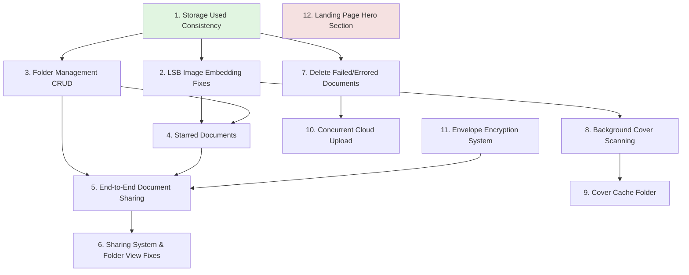

# Integration Roadmap: Implementing Planned Features

## Overview
This roadmap outlines how to integrate all 12 planned features from `plans/plans` into the current codebase, **minimizing new file creation** and leveraging existing architecture.

---

## Execution Order & Dependencies



---

## 1. Storage Used Consistency (`e5f22a4`)
**Priority: HIGH** | **New Files: 0**

### Files to Modify:
- `app/Models/User.php` - Add `documents()` relationship and `refreshStorageUsed()` method
- `app/Http/Controllers/DocumentController.php` - Add `$user->refreshStorageUsed()` in `index()` and `destroy()`
- `app/Services/Stego/StegoDocumentService.php` - Replace manual storage decrement with `refreshStorageUsed()` after batch upload

### Implementation Steps:
1. Add to `User.php`:
   ```php
   public function documents()
   {
       return $this->hasMany(Document::class, 'owner_id');
   }
   
   public function refreshStorageUsed(): void
   {
       $this->storage_used = $this->documents()->sum('in_cloud_size');
       $this->saveQuietly();
   }
   ```

2. Modify `DocumentController::index()` - Add before document query:
   ```php
   $user->refreshStorageUsed();
   ```

3. Modify `DocumentController::destroy()` - Replace manual decrement:
   ```php
   // Remove manual storage decrement, add after deletion:
   $user->refreshStorageUsed();
   ```

---

## 2. LSB Image Embedding Fixes (`e5d62f3`)
**Priority: HIGH** | **New Files: 0**

### Files to Modify:
- `app/Services/Stego/StegoService.php` - Update `embedLSB()` method to detect channels dynamically and add capacity methods

### Implementation Steps:
1. Add capacity helper methods to `StegoService`:
   ```php
   private function getImageSafeCapacity(string $carrierPath): int
   {
       $image = $this->loadImage($carrierPath, mime_content_type($carrierPath));
       $width = imagesx($image);
       $height = imagesy($image);
       $channels = $this->detectChannels($image);
       imagedestroy($image);
       return (int) ($width * $height * $channels * 0.9); // 90% safety buffer
   }
   
   private function detectChannels(GdImage $image): int
   {
       // Check if image supports alpha channel
       return imageistruecolor($image) && imagecolortransparent($image) === -1 ? 4 : 3;
   }
   ```

2. Modify `embedLSB()` to use dynamic channels:
   - Replace hardcoded RGB with channel detection
   - Add `###END###` delimiter (9 bytes) subtraction: `max(0, usable_bytes - 9)`

---

## 3. Folder Management CRUD (`f750cfd`)
**Priority: HIGH** | **New Files: 0**

### Files to Modify:
- `app/Http/Controllers/FolderController.php` - Add `update()` and `destroy()` methods
- `app/Http/Controllers/DocumentController.php` - Add `moveDocument()` method
- `resources/js/Pages/Folders/Index.tsx` - Add edit/delete modal handlers (extend existing)
- `resources/js/Pages/MyDocuments.tsx` - Add `handleMove()` function

### Implementation Steps:
1. Add to `FolderController`:
   ```php
   public function update(UpdateFolderRequest $request, $id)
   {
       $folder = Folder::findOrFail($id);
       $this->authorize('update', $folder);
       $folder->update($request->validated());
       return response()->json(['message' => 'Folder renamed successfully']);
   }
   
   public function destroy($id)
   {
       $folder = Folder::findOrFail($id);
       $this->authorize('delete', $folder);
       $folder->documents()->update(['folder_id' => null]); // Move to root
       $folder->delete();
       return response()->json(['message' => 'Folder deleted']);
   }
   ```

2. Add `moveDocument()` to `DocumentController`:
   ```php
   public function moveDocument(Request $request, $id)
   {
       $document = Document::findOrFail($id);
       $this->authorize('update', $document);
       $request->validate(['folder_id' => 'nullable|exists:folders,id']);
       // Verify folder ownership
       if ($request->folder_id) {
           $folder = Folder::findOrFail($request->folder_id);
           if ($folder->user_id !== Auth::id()) abort(403);
       }
       $document->update(['folder_id' => $request->folder_id]);
       return response()->json(['message' => 'Document moved']);
   }
   ```

---

## 4. Starred Documents (`e27e369`)
**Priority: MEDIUM** | **New Files: 0**

### Files to Modify:
- `app/Http/Controllers/StarredController.php` - Add `toggleStar()` method
- `resources/js/Pages/Starred/Index.tsx` - Add polling for processing status, status helpers
- `resources/js/Pages/MyDocuments.tsx` - Add `handleToggleStar()` and star button click handler

### Implementation Steps:
1. Add `toggleStar()` to `StarredController`:
   ```php
   public function toggleStar(Request $request)
   {
       $request->validate(['document_id' => 'required|exists:documents,id']);
       $document = Document::findOrFail($request->document_id);
       $this->authorize('update', $document);
       $document->update(['is_starred' => !$document->is_starred]);
       return response()->json(['is_starred' => $document->is_starred]);
   }
   ```

2. Update `MyDocuments.tsx` - Add star button handler:
   ```typescript
   const handleToggleStar = async (id: number) => {
       await axios.post('/documents/toggle-star', { document_id: id });
       // Update local state
   };
   // Add onClick to star button: onClick={() => handleToggleStar(id)}
   ```

---

## 5. End-to-End Document Sharing (`40355e0`)
**Priority: HIGH** | **New Files: 1** (required: `app/Http/Controllers/Api/ShareController.php`)

### Files to Modify:
- `app/Http/Controllers/ShareDocumentController.php` - Refactor `sharedDocuments()` to `share()`, remove merge conflicts
- `resources/js/Components/ShareModal.tsx` - Update `handleShare()` to use `/documents/share` endpoint
- `resources/js/Pages/MyDocuments.tsx` - Add `handleShare()` and share button click handler

### Implementation Steps:
1. Rename method in `ShareDocumentController`:
   ```php
   public function share(StoreShareDocumentRequest $request) 
   {
       // Existing sharedDocuments logic, renamed
       // Use fully qualified User model: \App\Models\User::class
   }
   ```

2. Update `ShareModal.tsx`:
   ```typescript
   const handleShare = async () => {
       await axios.post('/documents/share', {
           shared_id: documentId,
           slug: slug,
           recipient_emails: selectedUsers.map(u => u.email)
       });
   };
   ```

---

## 6. Sharing System & Folder View Fixes (`80de4a5`)
**Priority: MEDIUM** | **New Files: 0**

### Files to Modify:
- `app/Http/Controllers/DocumentController.php` - Add `encryption_mode` to queries
- `app/Http/Controllers/FolderController.php` - Fix folder content display
- `app/Http/Controllers/ShareDocumentController.php` - Implement permission handling in `share()`

### Implementation Steps:
1. Update `DocumentController::index()`:
   ```php
   $documents = Document::with('tags')
       ->accessibleBy($user)
       ->select(['id', 'name', 'encryption_mode', ...]) // Add encryption_mode
       ->latest()->get();
   ```

2. Enhance `FolderController::index()` for content view fixes

---

## 7. Delete Failed/Errored Documents (`3b643e4`)
**Priority: MEDIUM** | **New Files: 0**

### Files to Modify:
- `app/Http/Controllers/DocumentController.php` - Expand `destroy()` for intermediate states
- `app/Services/Stego/StegoDocumentService.php` - Add `deleteWithRetry()` and `cleanupOnFailure()`

### Implementation Steps:
1. Modify `DocumentController::destroy()`:
   ```php
   public function destroy(Document $document)
   {
       // Handle intermediate states: uploaded, encrypted, fragmented, embedded
       $deletableStates = ['uploaded', 'encrypted', 'fragmented', 'embedded', 'error'];
       if (in_array($document->ingest_status, $deletableStates)) {
           // Cloud deletion, storage cleanup, DB deletion
       }
   }
   ```

---

## 8. Background Cover Scanning (`454f8ef`)
**Priority: LOW** | **New Files: 1** (required: `app/Jobs/ScanCoversJob.php`)

### Files to Modify:
- `app/Http/Controllers/Api/StegoDocumentController.php` - Modify `scan_cover()` to dispatch job
- `app/Services/Stego/CloudStorageService.php` - Move scanning logic to job

### Implementation Steps:
1. Create `ScanCoversJob` (minimal new file):
   ```php
   class ScanCoversJob implements ShouldQueue {
       public function handle() {
           // Call existing scan logic for audio, image, text types
       }
   }
   ```

2. Update controller:
   ```php
   public function scan_cover() {
       dispatch(new ScanCoversJob());
       return response()->json(['message' => 'Scan queued']);
   }
   ```

---

## 9. Cover Cache Folder (`eaf10e3`)
**Priority: LOW** | **New Files: 0**

### Files to Modify:
- `app/Services/Stego/CloudStorageService.php` - Add `fetchCoverFiles()` with cache logic

### Implementation Steps:
1. Add cache logic to `CloudStorageService`:
   ```php
   public function fetchCoverFiles(string $mapId): array
   {
       $cachePath = storage_path("app/covers/{$mapId}");
       if (!is_dir($cachePath)) mkdir($cachePath, 0755, true);
       
       // Check cache first, then download from cloud, save to cache
   }
   ```

---

## 10. Concurrent Cloud Upload (`88fb894`)
**Priority: LOW** | **New Files: 1** (required: `app/Services/Stego/B2Service.php`)

### Files to Modify:
- `app/Services/Stego/StegoDocumentService.php` - Update `embedFragments()` to use batch upload

### Implementation Steps:
1. Create `B2Service::storeFilesBatch()` for concurrent uploads (Guzzle Pool)
2. Modify `embedFragments()` to use batch method with 10 concurrency limit

---

## 11. Envelope Encryption System (`af5beac`)
**Priority: HIGH** | **New Files: 1** (required: `app/Services/DocumentDecryptionService.php`)

### Files to Modify:
- `app/Services/DocumentEncryptionService.php` - Add `generateRandomDEK()`, `wrapDEK()`, `unwrapDEK()`
- `app/Models/Document.php` - Add `isEnvelopeMode()`, `getWrappedDekForUser()`, `sharedWith()` with pivot columns
- `app/Http/Controllers/Auth/RegisteredUserController.php` - Update `store()` with 10-minute session expiry

### Implementation Steps:
1. Add envelope methods to `DocumentEncryptionService`:
   ```php
   public function generateRandomDEK(): string {
       return bin2hex(random_bytes(32));
   }
   public function wrapDEK(string $dek, string $userMasterKey): array {
       // AES-256-GCM wrap with random nonce
   }
   ```

2. Update `RegisteredUserController::store()`:
   ```php
   session(['stego_mkd' => $mkdResult['masterKey']]);
   // Add 10-minute expiry:
   // Use cache instead: Cache::put("user_mkd_{$user->id}", $mkdResult['masterKey'], now()->addMinutes(10));
   ```

---

## 12. Landing Page Hero Section (`b6cbcf5`)
**Priority: LOW** | **New Files: 0**

### Files to Modify:
- `resources/js/Pages/Welcome.tsx` - Replace default Laravel content with hero section

### Implementation Steps:
1. Rewrite `Welcome.tsx`:
   - Import `DecorativeBackground` component (already exists)
   - Implement hero section with gradient text and CTA buttons
   - Add "How it Works" section with 3 feature cards
   - Add footer with quick links and social icons
   - Use inline styles for animations (fade-in, float, bounce-slow)

---

## Summary: New Files Required

| Feature | New Files Needed | Reason |
|---------|------------------|--------|
| 1-7, 9, 12 | **0** | Can be done by modifying existing files |
| 8 | 1 | `ScanCoversJob.php` (job required for async processing) |
| 10 | 1 | `B2Service.php` (service class for concurrent uploads) |
| 11 | 1 | `DocumentDecryptionService.php` (separate service for decryption logic) |
| 5 | 1 | `Api/ShareController.php` (if API route separation needed) |

**Total New Files: 3-4** (minimized from potential 12+)

---

## Recommended Implementation Order

1. **Storage Used Consistency** - Foundation for accurate tracking
2. **LSB Image Embedding Fixes** - Critical for steganography reliability
3. **Folder Management CRUD** - Core functionality enhancement
4. **Starred Documents** - User experience improvement
5. **Envelope Encryption System** - Security foundation for sharing
6. **End-to-End Document Sharing** - Depends on encryption + folder management
7. **Sharing System & Folder View Fixes** - Polish after core sharing works
8. **Delete Failed/Errored Documents** - Error handling improvement
9. **Background Cover Scanning** - Performance optimization
10. **Cover Cache Folder** - Further performance optimization
11. **Concurrent Cloud Upload** - Performance for batch operations
12. **Landing Page Hero Section** - Marketing/presentation enhancement
